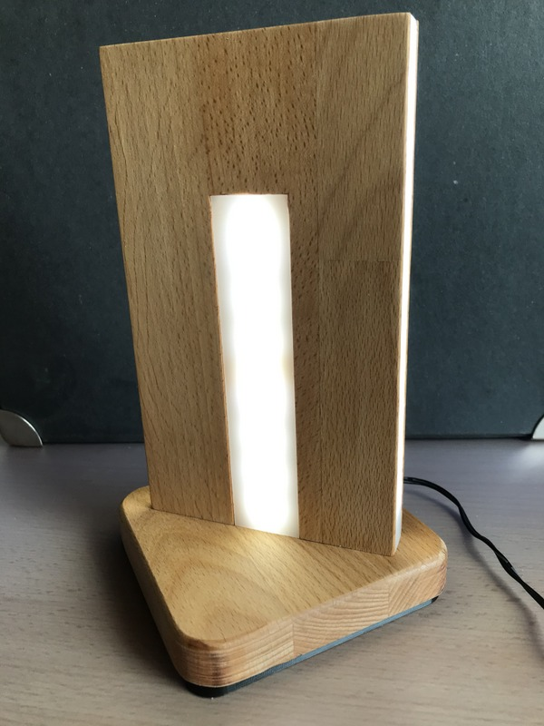

# Bedside_Touch_Light
a lamp with reacts on simple touch gestures\
{:height="50%" width="50%"}
## Schematic
schematic is rather easy and straight forward. A LDO to build 5V out of 12V, driving a buzzer and a higher current transistor for the led strip

finaly it looks like this\
\
Some more information you can find on my website
